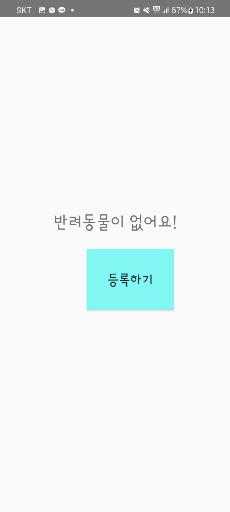
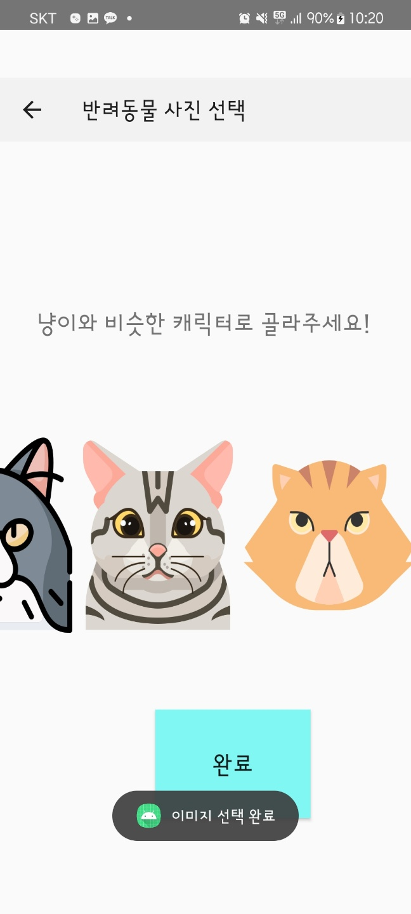
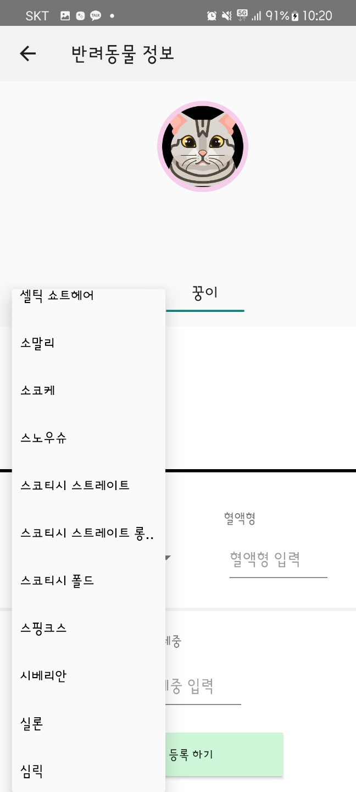
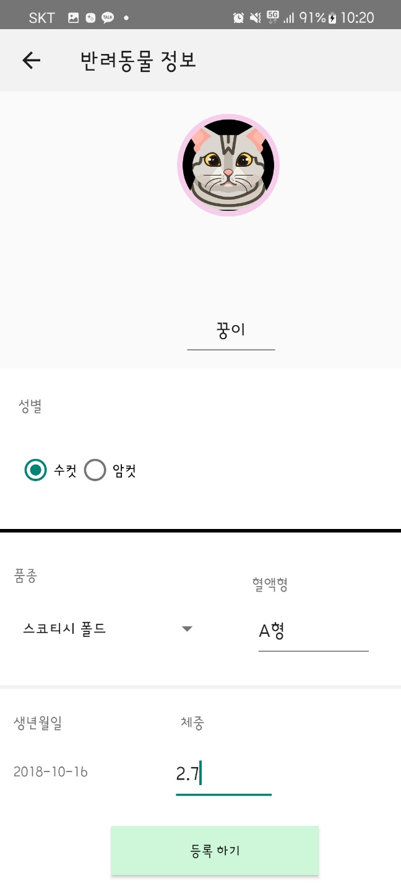
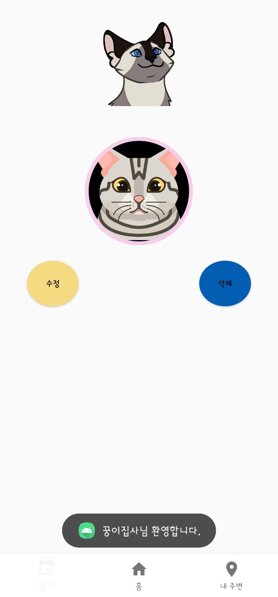
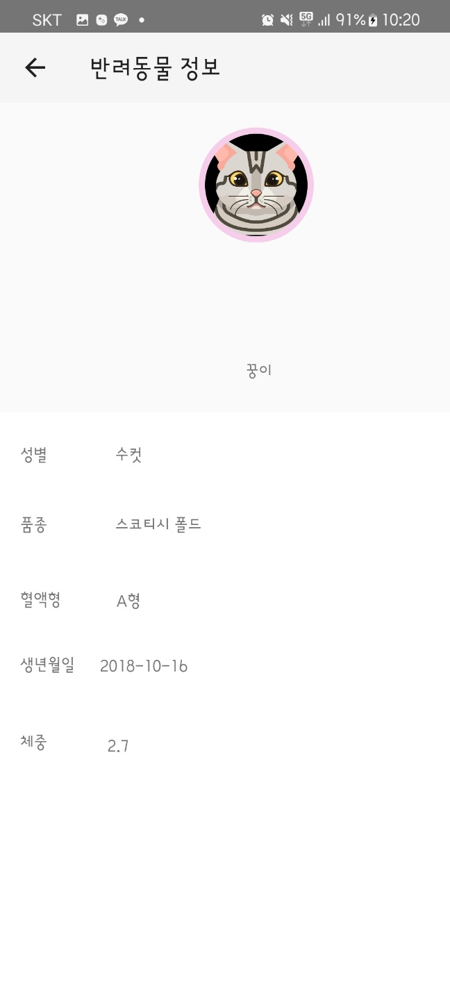
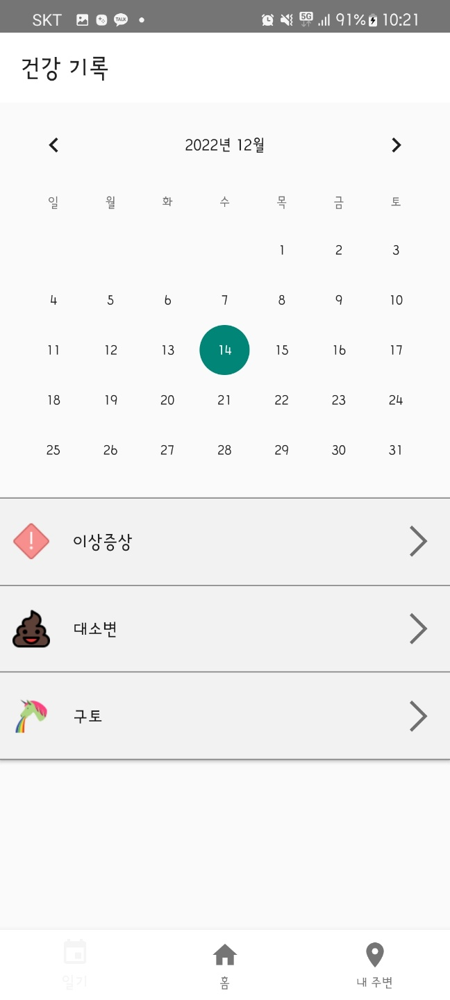
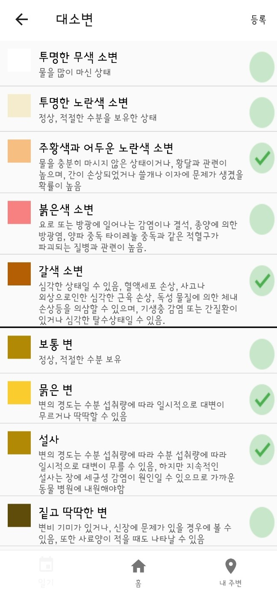
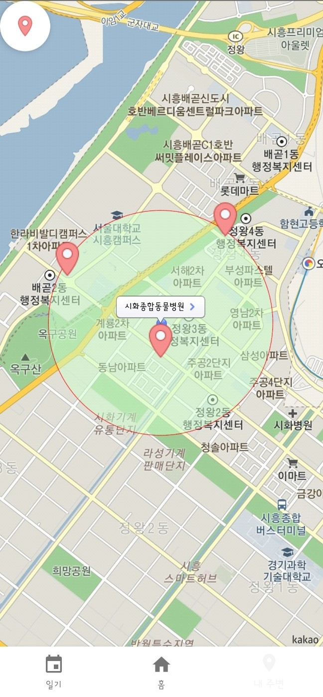

## :mag_right: 프로젝트 소개
- 인하공업전문대학 2학년 2학기 모바일프로그래밍 응용 텀 프로젝트
- 일일 단위로 고양이의 건강을 기록하는 애플리케이션
  
## ⏰ 개발기간 및 인원
- 2022.09.09 ~ 2022.12.15
- 1인 개발

## :hammer: 개발환경
**IDE**

**Development**

## 주요기능 
| | |
| :----: | :----: | 
|**로딩 화면**|**고양이 정보가 없는 경우**|
|||
|**고양이 이미지 고르기**|**고양이 종 고르기**|
|||
|**고양이 정보 입력 완성 화면**|**고양이 정보 입력 완성 후 메인 화면**|
|||
|**고양이 정보 확인**|**기록할 날짜 고르기**|
|||
|**이상 증상 체크하기**|**대소변 체크하기**|
|||
|**구토 증상 체크하기**|**1Km 주변 동물병원 위치 보기**|
