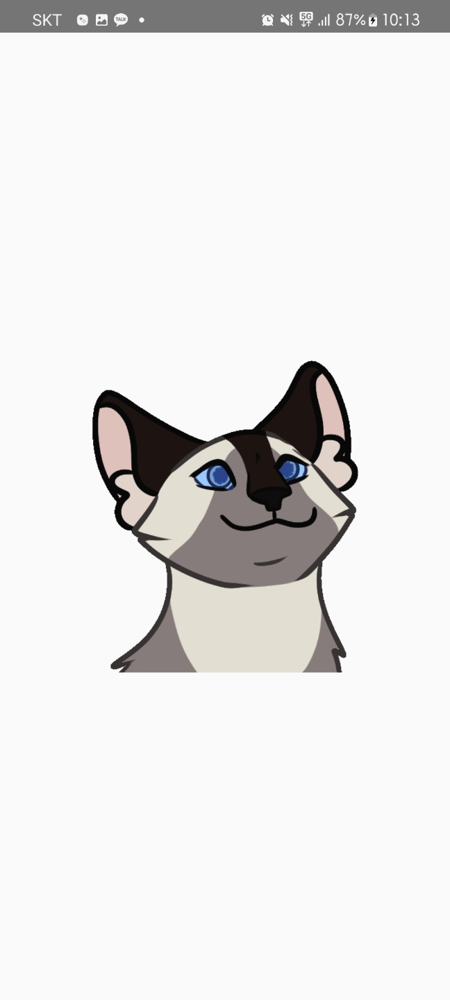

# 2-2 모바일프로그래밍 응용 텀 프로젝트
## 고양이 건강 기록 어플리케이션

**로딩 화면**  

  
**고양이 정보가 없는 경우**  

  
**고양이 이미지 고르기**  

  
**고양이 종 고르기**  

  
**고양이 정보 입력 완성 화면**  

  
**고양이 정보 입력 완성 후 메인 화면**  

  
**고양이 정보 확인**  

  
**기록할 날짜 고르기**  

  
**이상 증상 체크하기**  

  
**대소변 체크하기**  

  
**구토 체크하기**  

  
**주변 동물병원 위치 보기**  

